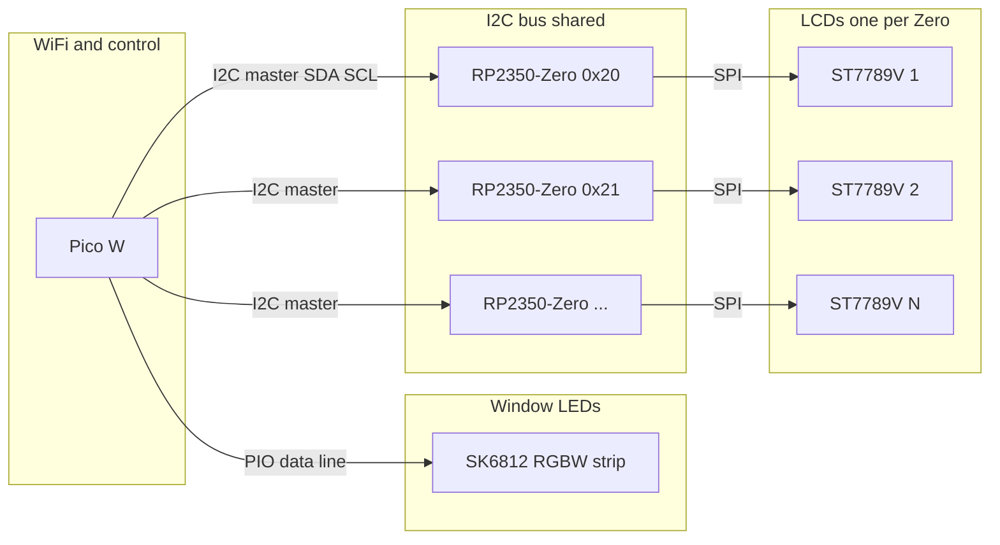

# Village – Book Nook Diorama

Narrow Tudor-style alley with window LEDs (oil lamp / fireplace) and LCD “shadow” animations, controllable over WiFi (MQTT / Home Assistant).

## Architecture

- **Pico W**: WiFi, MQTT, SK6812 RGBW LEDs (PIO), I2C master. Sends scene/trigger to each LCD controller.
- **RP2350-Zero** (one per LCD): I2C slave, ST7789V display, bitmap animations from `bitmap_anim.bin`. LCD count is configurable.

See [docs/wiring.md](docs/wiring.md), [docs/i2c_protocol.md](docs/i2c_protocol.md), and [docs/mqtt_topics.md](docs/mqtt_topics.md).

## Hardware connections

### System overview

- **Pico W** is the only board with WiFi. It runs MQTT, drives the LED strip (one data GPIO via PIO), and talks to all LCD controllers on one **I2C bus** (master).
- Each **RP2350-Zero** is an I2C slave with a **unique address** (e.g. 0x20, 0x21, 0x22). Same firmware on every Zero; only the address changes. Each Zero drives one **ST7789V** display over SPI.
- **SK6812** strip: one wire from Pico W (data); power the strip from a suitable supply, not from the Pico W.

### Pico W – pin assignment

All pin numbers are **GPIO** (physical pin labels may differ; use the GPIO number in firmware).

| Pico W GPIO | Function | Connects to |
|-------------|----------|-------------|
| **GP0** | SK6812 data (PIO) | LED strip DATA IN (level-shift to 5 V if strip is 5 V) |
| **GP4** | I2C SDA (master) | I2C bus SDA → **RP2350-Zero GP4** (SDA) on every Zero, plus 2.2–4.7 kΩ pull-up to 3.3 V |
| **GP5** | I2C SCL (master) | I2C bus SCL → **RP2350-Zero GP5** (SCL) on every Zero, plus 2.2–4.7 kΩ pull-up to 3.3 V |
| **3V3** | 3.3 V out | Shared 3.3 V rail (optional for Zeros if they are self-powered via USB) |
| **GND** | Ground | Common GND with all RP2350-Zero boards and I2C bus |

**Reserved (do not use):** GP23, GP24, GP25 (onboard WiFi chip).

Config: `firmware/pico_w/config.py` — `LED_DATA_PIN`, `I2C_SDA_PIN`, `I2C_SCL_PIN`.

### RP2350-Zero – pin assignment (per board)

Pin numbers are **GPIO** on the RP2350-Zero. Defaults match `firmware/rp2350_lcd/config.py`; change there if your board or display uses different pins.

**I2C (to Pico W and other Zeros on shared bus):**

| RP2350-Zero GPIO | Function | Connects to |
|------------------|----------|-------------|
| **GP4** | I2C SDA (slave) | I2C bus SDA → **Pico W GP4** (SDA) and all other RP2350-Zero GP4 |
| **GP5** | I2C SCL (slave) | I2C bus SCL → **Pico W GP5** (SCL) and all other RP2350-Zero GP5 |

**SPI and display control (to one ST7789V per board):**

| RP2350-Zero GPIO | Function | Connects to |
|------------------|----------|-------------|
| **GP2** | SPI SCK | ST7789V SCL/SCK |
| **GP3** | SPI MOSI | ST7789V SDA/MOSI |
| **GP9** | LCD CS | ST7789V CS (config `LCD_CS`; must not be GP5 so I2C SCL is free) |
| **GP6** | LCD DC | ST7789V DC/RS |
| **GP7** | LCD RST | ST7789V RST/RESET |
| **GP8** | LCD backlight | ST7789V BL/LED |

**Power:** 3V3 and GND to shared rail. Config: `I2C_SDA_PIN`, `I2C_SCL_PIN`, `SPI_SCK`, `SPI_MOSI`, `LCD_CS`, `LCD_DC`, `LCD_RST`, `LCD_BL`. Check the [Waveshare ST7789V wiki](https://www.waveshare.com/wiki/) for your module’s exact pinout; adjust config if needed.

### Wire list (what connects to what)

| From | To | Wire |
|------|-----|------|
| Pico W **GP0** | SK6812 strip DATA IN | LED data (PIO) |
| Pico W **GP4** | Every RP2350-Zero **GP4** | I2C SDA (one shared bus; add pull-up to 3.3 V) |
| Pico W **GP5** | Every RP2350-Zero **GP5** | I2C SCL (one shared bus; add pull-up to 3.3 V) |
| Pico W **GND** | Every RP2350-Zero **GND** | Common ground |
| Each RP2350-Zero **GP2** | That board’s ST7789V SCK | SPI clock |
| Each RP2350-Zero **GP3** | That board’s ST7789V MOSI | SPI data |
| Each RP2350-Zero **GP6, GP7, GP8** | That board’s ST7789V DC, RST, BL | Display control and backlight |
| Each RP2350-Zero **GP9** (LCD_CS in config) | That board’s ST7789V CS | Chip select |

### Power and ground

- **3.3 V** and **GND** must be shared between Pico W, all RP2350-Zero boards, and the I2C bus (common ground).
- Power the **SK6812** strip from its own supply (e.g. 5 V); do not feed high current through the Pico W.

## Folders

| Path | Description |
|------|-------------|
| `firmware/pico_w/` | Pico W MicroPython: config, MQTT, LEDs, I2C master |
| `firmware/rp2350_lcd/` | RP2350-Zero MicroPython: I2C slave, ST7789, animations |
| `tools/` | `image_sequence_to_bitmap.py`: numbered folders 0–254 → `bitmap_anim.bin` (and C), up to 255 scenes |
| `docs/` | Wiring, I2C protocol, MQTT topics |
| `assets/` | Art reference; source images for the tool (e.g. Blender exports) |

## Quick start

1. **Pico W**: Copy `firmware/pico_w/*.py` to the board. Edit `config.py` (WiFi, MQTT, `lcd_i2c_addresses`, LED count). Run `main.py`.
2. **RP2350-Zero**: Copy `firmware/rp2350_lcd/` to each board. Set `I2C_SLAVE_ADDR` in `config.py` per board. Run `main.py`.
3. Run `tools/image_sequence_to_bitmap.py` on a root folder with subfolders 0–254 of images; copy the generated `bitmap_anim.bin` to each RP2350-Zero.
4. Wire I2C (SDA/SCL), LEDs, and LCDs per `docs/wiring.md`. Publish to MQTT topics in `docs/mqtt_topics.md` (scene 0–254).

The RP2350-Zero firmware includes a hardware I2C slave (`i2c_slave_hw.py`) so it receives scene/brightness from the Pico W without external libraries. The Pico W can run without a NeoPixel driver (LEDs no-op) for testing MQTT and I2C.

## Animation model

- **Bitmap-only**: All LCD animations are bitmaps generated by `tools/image_sequence_to_bitmap.py`. The tool reads a root folder with subfolders **0**–**254** (folder N = scene N); each subfolder has 1–120 numbered images (missing folder = 0 frames). Output is `bitmap_anim.bin` (and optional C files). Copy the `.bin` to each RP2350-Zero.
- **Up to 255 scenes** (0–254), **24 fps**, **loop** until another scene is set over I2C (or MQTT via Pico W).
