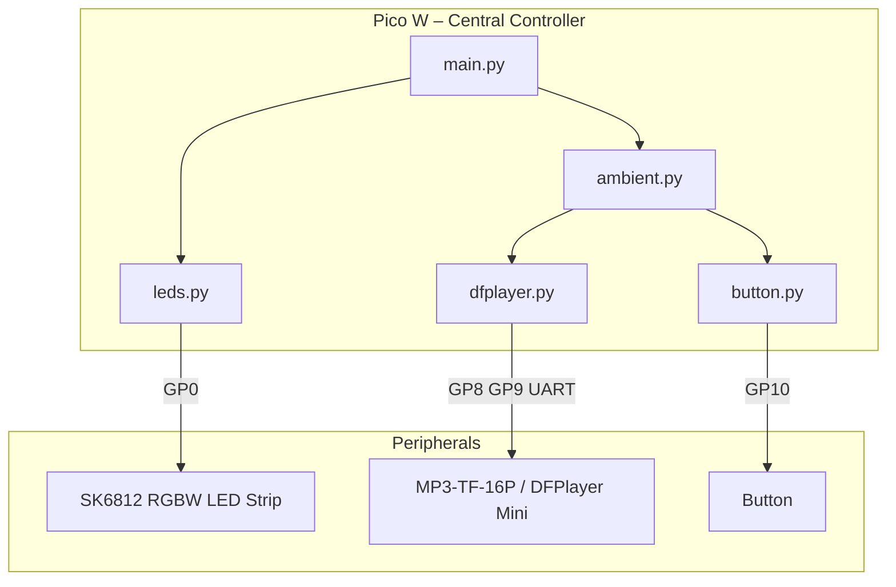
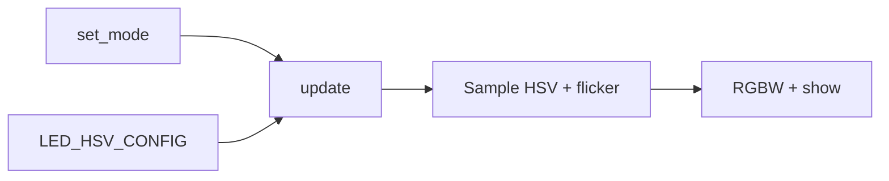
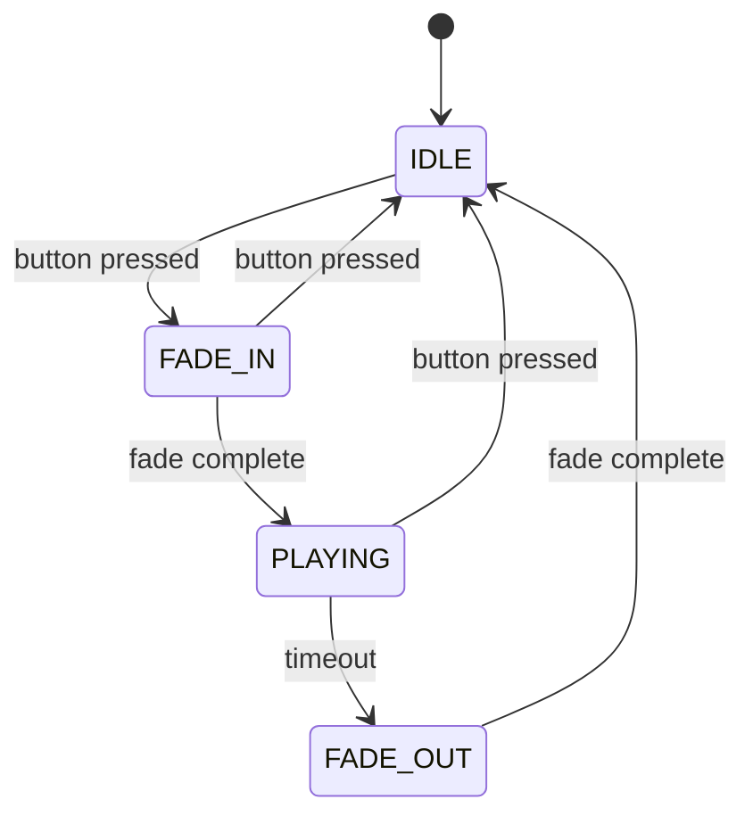

# Village – Book Nook Project

A diorama-style book nook with warm lighting (oil lamp / fireplace LEDs) and ambient sound. The Raspberry Pi Pico W acts as the central controller.

---

## Documentation

| Document | Description |
|----------|-------------|
| [docs/wiring.md](docs/wiring.md) | Pin assignments, wire list, and connection details for all hardware |
| [docs/leds_control.md](docs/leds_control.md) | SK6812 LED strip: HSV color model, flicker, lamp/fireplace effects |
| [docs/mp3_player.md](docs/mp3_player.md) | MP3-TF-16P / DFPlayer Mini: usage, formats, SD layout, API |
| [docs/mp3_commands.md](docs/mp3_commands.md) | Full serial command reference for the MP3 module |
| [docs/mqtt_topics.md](docs/mqtt_topics.md) | MQTT topics for remote control (LEDs) |
| [firmware/README.md](firmware/README.md) | Pico W firmware: files, config, dependencies |

---

## System Architecture

```mermaid
flowchart TB
    subgraph PicoW [Pico W – Central Controller]
        main[main.py]
        leds_mod[leds.py]
        ambient_mod[ambient.py]
        dfplayer_mod[dfplayer.py]
        button_mod[button.py]
    end

    subgraph Peripherals [Peripherals]
        LED[SK6812 RGBW LED Strip]
        MP3[MP3-TF-16P / DFPlayer Mini]
        BTN[Button]
    end

    main --> leds_mod
    main --> ambient_mod
    ambient_mod --> dfplayer_mod
    ambient_mod --> button_mod

    leds_mod -->|GP0| LED
    dfplayer_mod -->|GP8 GP9 UART| MP3
    button_mod -->|GP10| BTN
```

---

## Wiring Summary

| Pico W Pin | Function | Connects To |
|------------|----------|-------------|
| **GP0** | SK6812 data | LED strip DATA IN |
| **GP8** | UART1 TX | MP3 module pin 2 (RX) |
| **GP9** | UART1 RX | MP3 module pin 3 (TX) |
| **GP10** | Button | Momentary switch → GND |
| **GND** | Ground | All peripherals |
| **3V3** | 3.3 V | Shared rail |

**Do not use:** GP23, GP24, GP25 (onboard WiFi).

See [docs/wiring.md](docs/wiring.md) for full pinout and MP3 module details.

---

## Bill of Materials (BOM)

### Core (required)

| Item | Qty | Notes |
|------|-----|-------|
| Raspberry Pi Pico W | 1 | MicroPython |
| SK6812 RGBW LED strip | 1 | Configurable count; typically 20 LEDs |
| MP3-TF-16P v3.0 or DFPlayer Mini | 1 | UART-controlled MP3 playback |
| Micro SD card | 1 | FAT16/FAT32, max 32 GB; MP3, WAV, WMA |
| Momentary push button | 1 | Ambient sound trigger |
| Speaker or amplifier | 1 | Connect to MP3 DAC (pins 4, 5) or SPK (6, 8) |

### Optional

| Item | Qty | Notes |
|------|-----|-------|
| Level shifter (74AHCT125) | 1 | If LED strip is 5 V logic |
| 1 kΩ resistors | 1–2 | Optional; MP3 TX/RX if buzzing |

---

## Component Logic

### Pico W (main.py)

- **Role:** Central hub. Initializes LEDs, MP3 module, and button; runs main loop every ~50 ms.
- **Loop:** `leds.update()` → `ambient.update()` → `time.sleep_ms(50)`.
- **Optional:** WiFi + MQTT for remote control of LED mode and brightness (see [docs/mqtt_topics.md](docs/mqtt_topics.md)).

### LEDs (leds.py)

- **Role:** Warm lighting effects (oil lamp, fireplace) via SK6812 RGBW strip.
- **Modes:** `off`, `lamp` (orange), `fireplace` (redder, dimmer).
- **Logic:** Per-LED HSV base color + random flicker; converted to RGBW; global brightness; R/G swap for hardware. Throttled to ~35 ms per frame.

```mermaid
flowchart LR
    A[set_mode] --> B[update]
    C[LED_HSV_CONFIG] --> B
    B --> D[Sample HSV + flicker]
    D --> E[RGBW + show]
```

### Ambient audio (ambient.py + dfplayer.py + button.py)

- **Role:** Button-triggered ambient sound: random clips with fade-in, configurable timeout, fade-out.
- **Logic:** State machine IDLE → FADE_IN → PLAYING → FADE_OUT → IDLE. Second button press = immediate stop.

```mermaid
stateDiagram-v2
    [*] --> IDLE
    IDLE --> FADE_IN: button pressed
    FADE_IN --> PLAYING: fade complete
    FADE_IN --> IDLE: button pressed
    PLAYING --> FADE_OUT: timeout
    PLAYING --> IDLE: button pressed
    FADE_OUT --> IDLE: fade complete
```

- **Config:** `AMBIENT_TIMEOUT_SEC`, `AMBIENT_FADE_IN_MS`, `AMBIENT_FADE_OUT_MS`, `AMBIENT_VOLUME`, `BUTTON_PIN`.

### MQTT (optional)

- **Topics:** `booknook/village/leds/mode`, `booknook/village/leds/brightness`.
- **Use case:** Home Assistant or other controller for remote control.

---

## Quick Start

1. Clone/copy the firmware; edit `firmware/config.py` (WiFi, pins, LED count, etc.).
2. Copy firmware to Pico W; add `neopixel.py` driver for SK6812.
3. Wire per [docs/wiring.md](docs/wiring.md); format SD card; add ambient clips.
4. Run `main.py` on the Pico W.
