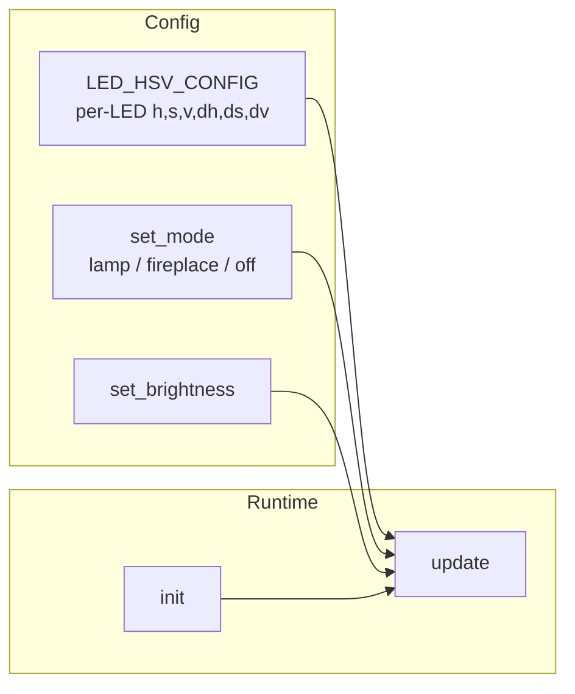
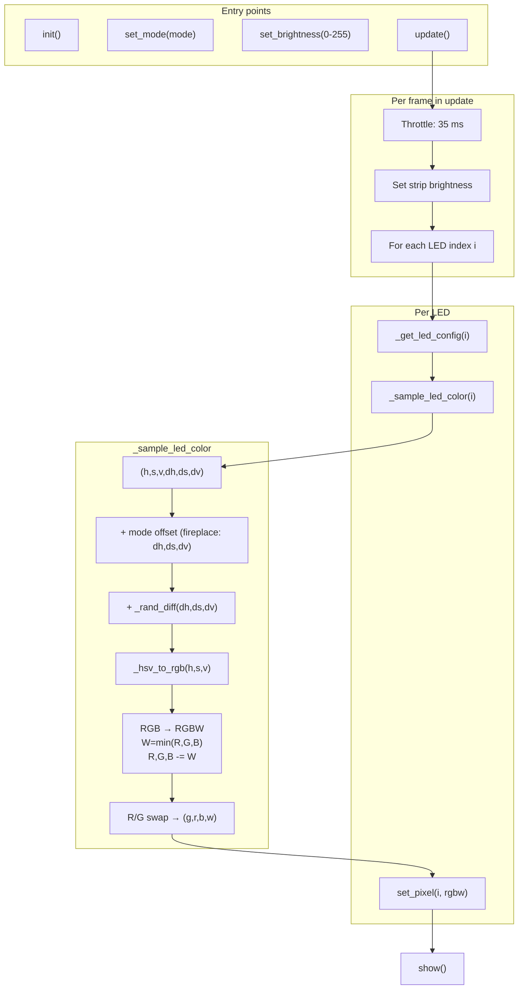
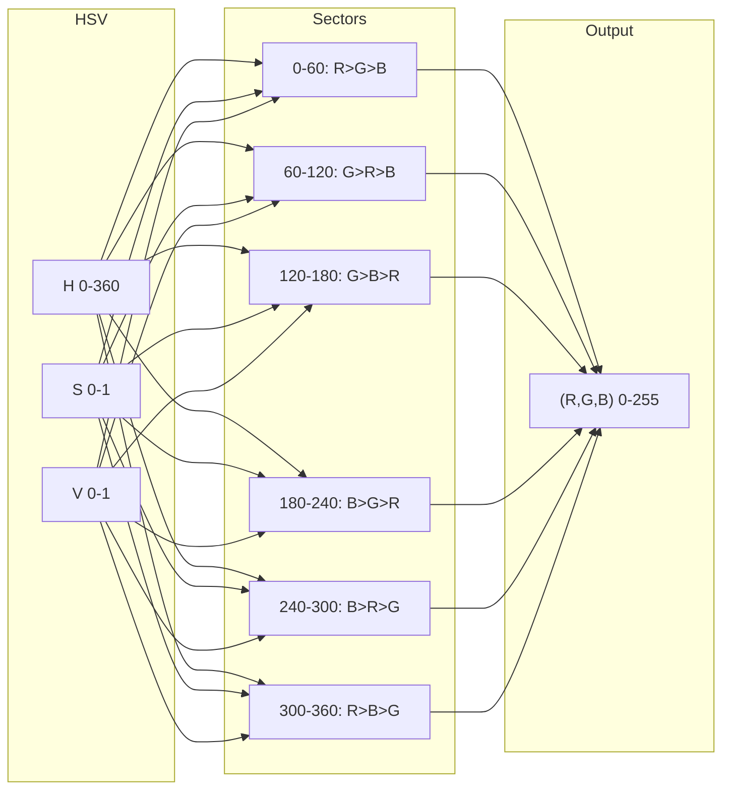
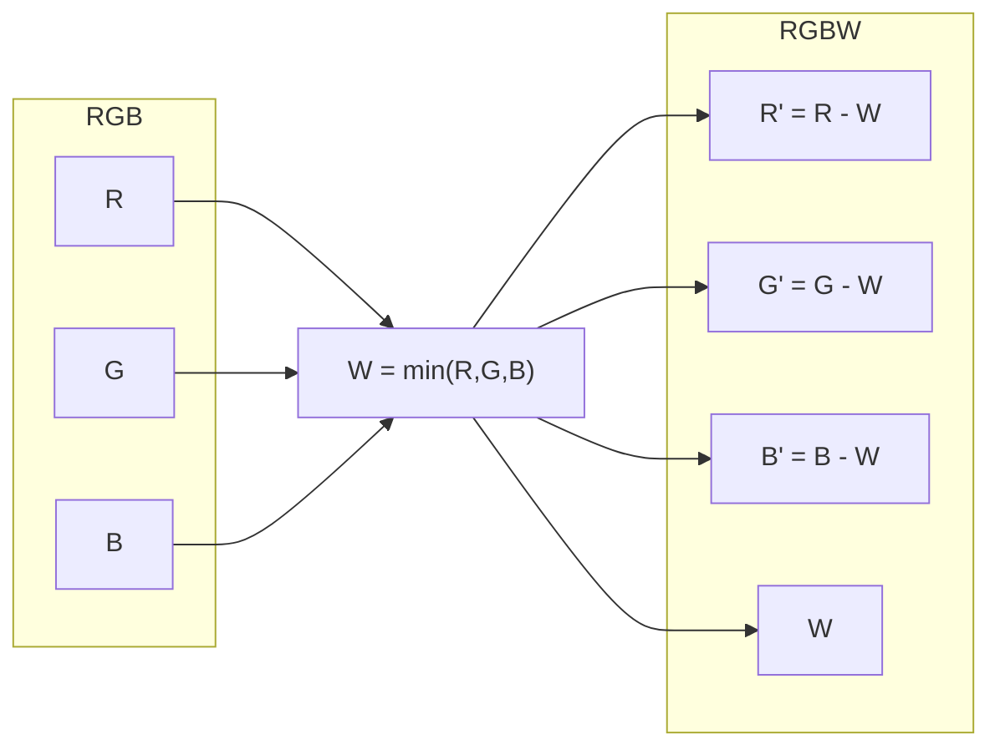
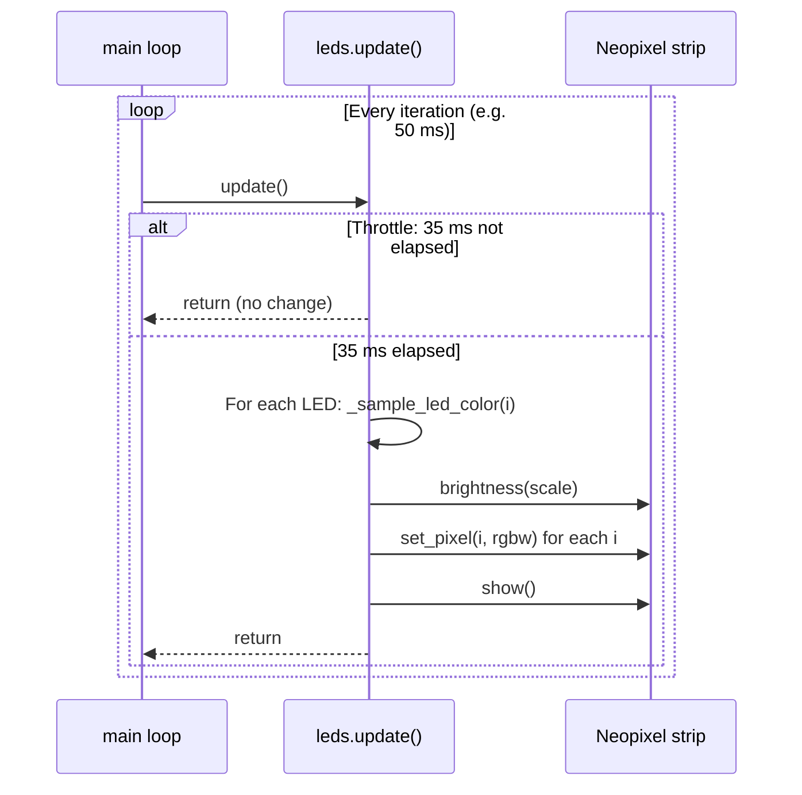

# Village – Pico W LED control and animation

This document describes how the SK6812 RGBW LED strip is driven by the Pico W firmware: configuration, color math (HSV → RGB → RGBW), per-LED flicker, and the main update loop.

---

## Overview

The `leds` module provides two warm-light effects—**lamp** (oil-lamp style) and **fireplace**—plus **off**. Each LED has its own base color and flicker strength defined in HSV. Every frame, each LED’s color is sampled in HSV with random variation, converted to RGB, then to RGBW for the strip; a global brightness and an R/G channel swap (for hardware) are applied before sending.

---

## Module layout and data flow

---

## Configuration (`config.py`)

| Symbol | Meaning |
|--------|--------|
| `LED_COUNT` | Number of LEDs on the strip |
| `LED_DATA_PIN` | GPIO pin for the strip data line (e.g. 0) |
| `LED_ORDER` | Wire/protocol order: `"RGBW"` or `"GRBW"` (used for RGBW vs RGB and for driver) |
| `LED_HSV_CONFIG` | List of 6-tuples per LED: `(h, s, v, dh, ds, dv)` |

### Per-LED tuple: `(h, s, v, dh, ds, dv)`

- **h** (0–360): Base hue in degrees (e.g. 0=red, 30=orange, 60=yellow).
- **s** (0–255): Base saturation (255 = full color; 0 = gray).
- **v** (0–255): Base value/brightness (255 = full).
- **dh** (degrees): Max magnitude of random hue flicker per frame (`±` via `magnitude*(rand()-rand())`).
- **ds** (0–255): Max magnitude of saturation flicker.
- **dv** (0–255): Max magnitude of value flicker.

If `LED_HSV_CONFIG` has fewer entries than `LED_COUNT`, missing LEDs get a default (e.g. warm orange, moderate flicker).

---

## Color calculation pipeline

### 1. Base HSV and mode offset

Each LED starts from its `(h, s, v, dh, ds, dv)`. A **mode offset** is added to the base (not to the random part):

- **lamp**: `(0, 0, 0)` — no offset.
- **fireplace**: `(dh=15, ds=-30, dv=-20)` — redder, less saturation and value.

So for fireplace, base `h` is shifted by +15°, and base `s`/`v` are reduced (before normalization).

### 2. Flicker (per channel)

Flicker is applied **per channel** with a scaled difference of two uniforms:

- `delta = magnitude * (random() - random())`
- `magnitude` is `dh` for hue, `ds` for saturation, `dv` for value (in their respective units).
- Result is roughly triangular (small deltas more likely), which gives a natural flicker.

Hue is wrapped: `h = (h + oh + _rand_diff(dh)) % 360`. Saturation and value are clamped to `[0, 255]` then normalized to `[0, 1]` for the converter.

### 3. HSV → RGB

Standard HSV-to-RGB conversion (hexagonal cone):

- **H** in [0, 360) is split into six 60° sectors.
- **S**, **V** in [0, 1]. Chroma `C = V*S`, secondary term `X = C*(1 - |(H/60) mod 2 - 1|)`, minimum `m = V - C`.
- Per sector, a triple `(p, q, 0)` is chosen from `(C, X, 0)` and its permutations; then `(p+m, q+m, m)` gives linear RGB in [0, 1], scaled to (R, G, B) in 0–255.

### 4. RGB → RGBW (when `LED_ORDER` contains `"W"`)

To avoid washing out the color and to use the white channel correctly:

- `W = min(R, G, B)` (common part).
- `R = R - W`, `G = G - W`, `B = B - W` (with clamp to 0).

So the same total light is represented as R, G, B, W without adding extra white on top of full RGB.

### 5. R/G swap and strip order

Some strips display the first and second channel swapped (e.g. red and green reversed). The code compensates by sending `(g, r, b, w)` instead of `(r, g, b, w)` to the driver, so the physical red and green LEDs receive the intended values.

### 6. Brightness

Global brightness (0–255) is applied **once** via the strip’s brightness API (e.g. `_strip.brightness(scale)` with `scale = _brightness / 255`). Pixel values are **not** pre-scaled in the loop to avoid double dimming.

---

## Animation loop (throttle and frame rate)

- **update()** is intended to be called from the main loop (e.g. every 10–50 ms).
- Inside **update()**, frames are **throttled** to at most one update every **35 ms** (using `time.ticks_ms()` and `time.ticks_diff()`).
- So the effective animation rate is about 28–29 fps, independent of how often the caller invokes `update()`.

---

## Public API summary

| Function | Purpose |
|----------|--------|
| **init()** | Create Neopixel strip (or DummyStrip), apply current mode. Call once at startup. |
| **set_mode(mode)** | Set `"off"`, `"lamp"`, or `"fireplace"`. Off fills strip black immediately. |
| **set_brightness(value)** | Set global brightness 0–255. |
| **update()** | Advance one animation frame (throttled). Call repeatedly from main loop. |

Internal helpers (for reference): `_hsv_to_rgb`, `_rand_unit`, `_rand_diff`, `_get_led_config`, `_sample_led_color`.

---

## File and config reference

- **Firmware:** `Village/firmware/leds.py`
- **Config:** `Village/firmware/config.py` (`LED_*`, `LED_HSV_CONFIG`)
- **Driver:** `neopixel.py` (e.g. pi_pico_neopixel) with `transfer_mode="PUT_CRITICAL"` to avoid glitches during `show()`.
